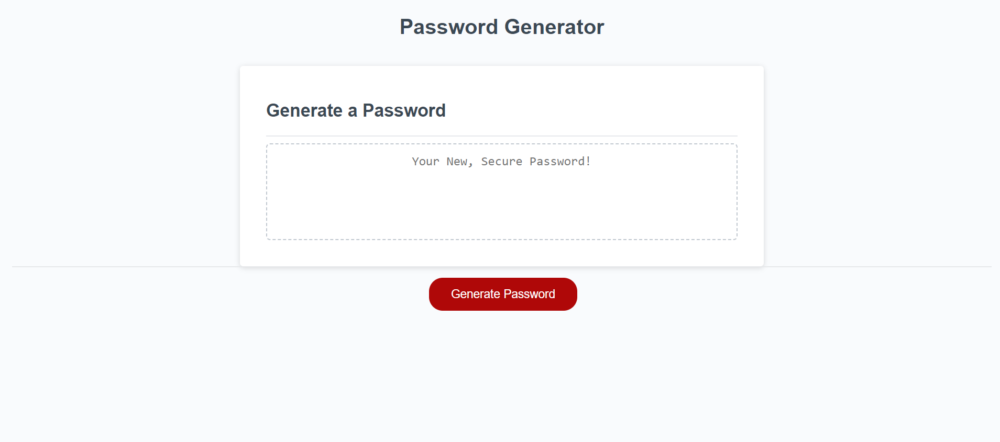
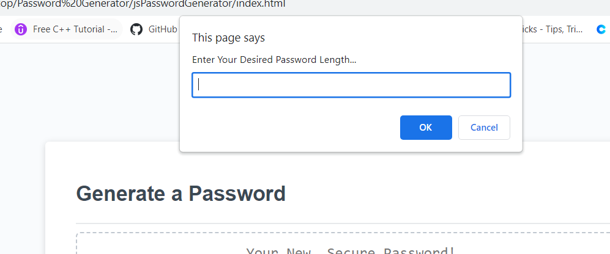
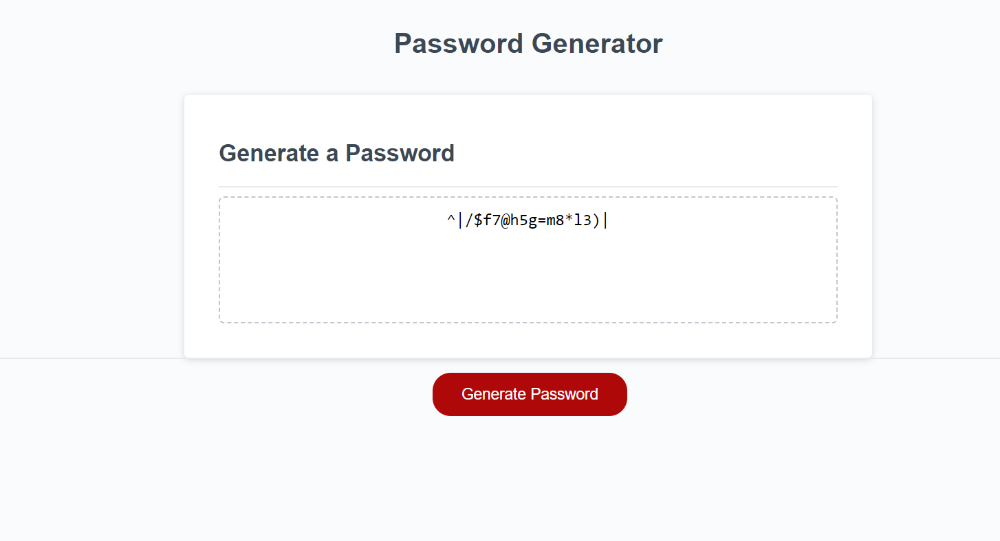

# jsPasswordGenerator

## Description:

In this fast-paced world, save time by using this password generator! "Press the generate" button, and then answer a series of prompts. Once you answer those prompts, a new password will be generated and displayed within the read-only text area. Before generating a new password, refresh the page.

## Screenshots:







## Link to deployed application:

https://walter-conwell.github.io/jsPasswordGenerator/

## repo link:

https://github.com/Walter-Conwell/jsPasswordGenerator

### Sources:

```
- Jacob Carver (tutoring)
- hackernoon.com (https://hackernoon.com/how-does-javascripts-math-random-generate-random-numbers-ef0de6a20131)
- web MDN Docs (https://developer.mozilla.org/en-US/docs/Web/JavaScript/Reference/Statements/for)

```
